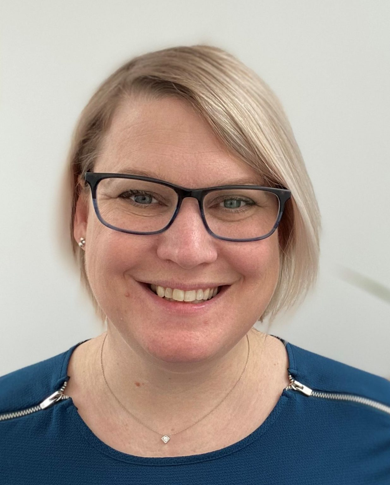
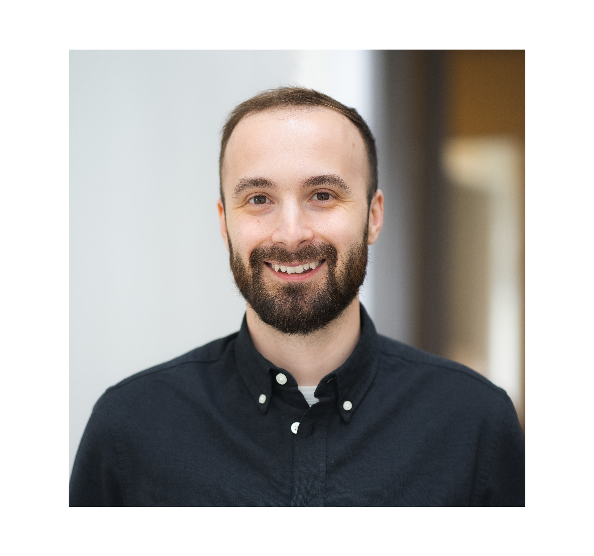

# Meet Your Faculty

#### Mélanie Courtot

>Senior Director Genome Informatics & Assistant Professor  
Ontario Institute for Cancer Research & University of Toronto  
Toronto, Ontario, Canada
>
> --- mcourtot@oicr.on.ca

Dr Mélanie Courtot is the Senior Director of Genome Informatics and a Principal Investigator at the Ontario Institute for Cancer Research in Toronto, and an Assistant Professor in the departments of Computer Science and Medical Biophysics at University of Toronto. Dr Courtot is passionate about translational informatics - building intelligent systems to gain new insights and impact human health. Her lab aims to build a globally shared knowledge ecosystem to advance science and improve health for all. This requires high-quality data, robust data integration processes at scale and discovery platforms providing data access across international borders. The software engineering team she leads at OICR develops the Overture software suite, which has helped managed ~3 million genomes (2.5 petabytes of data) accessed by over 300,000 researchers worldwide. Overture supports many active large-scale cancer genomics projects Dr Courtot leads. These include ICGC and ICGC-ARGO (collecting molecular and clinical data for over 100k patients worldwide), VirusSeq (Canadian Covid portal with over 600k SARS-CoV-2 sequences), and the pan-Canadian Genome Library. Her research lab complements these activities by exploring methodologies to extract and structure data using AI, LLMs as well  while improving its quality through standards design and development.

#### Mitchell Shiell

>Product Manager  
Ontario Institute for Cancer Research  
Toronto, Ontario, Canada
>
> --- mshiell@oicr.on.ca

Mitchell Shiell serves as Product Manager and Outreach Lead for the Genome Informatics team at the Ontario Institute for Cancer Research (OICR), helping drive the development of the Overture platform. Overture is an open-source collection of software used to build platforms that manage research data at scale across major global initiatives including ICGC-ARGO (100,000+ cancer patients), PCGL (large genomic files), OHCRN (hereditary cancer data), and iMicroSeq (600,000+ viral genomes). A large part of his work centers on making these data management capabilities accessible to smaller research groups through user-centered design, deployment automations, and comprehensive documentation. His group's mission is to empower research teams of all sizes to connect and collaborate over their data.

#### Linda Xiang

>Data Scientist II  
Ontario Institute for Cancer Research  
Toronto, Ontario, Canada
>
> --- lxiang@oicr.on.ca

Linda is a Senior Data Scientist with over a decade of experience designing and delivering production-grade data platforms for large-scale international genomics initiatives, including ICGC/ICGC-ARGO, PCAWG, GDC, and VirusSeq. Her work focuses on bridging complex scientific requirements with robust engineering solutions, spanning bioinformatics workflow architecture, data services, and platform integration. She has led the development of containerized, reproducible pipelines for genomic data processing and submission across cloud and on-premises environments, and has driven the adoption of standards-based frameworks to improve scalability and maintainability. In parallel, she has led the design of interoperable clinical and genomic data models to support secure data sharing and federated analysis, while contributing to global standards development through GA4GH.

#### Hardeep Nahal-Bose

>Senior Bioinformatics Data Manager  
Ontario Institute for Cancer Research  
Toronto, Ontario, Canada
>
> --- hnahal@oicr.on.ca

#### Edmund Su

>Bioinformatician  
Ontario Institute for Cancer Research  
Toronto, Ontario, Canada
>
> --- edmund.su@oicr.on.ca

Edmund is a bioinformatician interested in advancing patient outcomes and uncovering disease pathology through the analysis of clinical and genomics data. As a member of the genome informatics team, he has contributed to projects such as Virus-Seq/iMicro-seq, Pan Canadian Genome library (PCGL), and notably ICGC-ARGO. Through the ICGC-ARGO project, he has coordinated the analysis of the ICGC-ARGO dataset, developed and maintained genomic data processing pipelines, established WGS standards as part of GA4GH. 

#### David Bujold

<!--#### NAME

>JOB TITLE  
INSTITUTION  
LOCATION
>
> --- CONTACT INFO, IF PROVIDED

BIO GOES HERE-->

