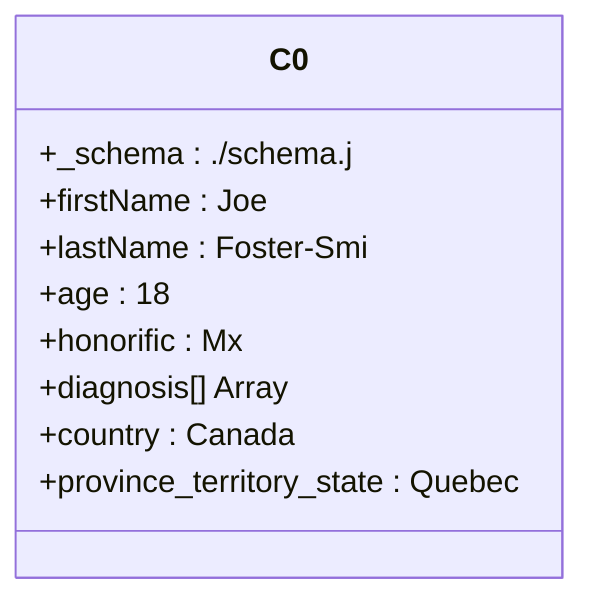
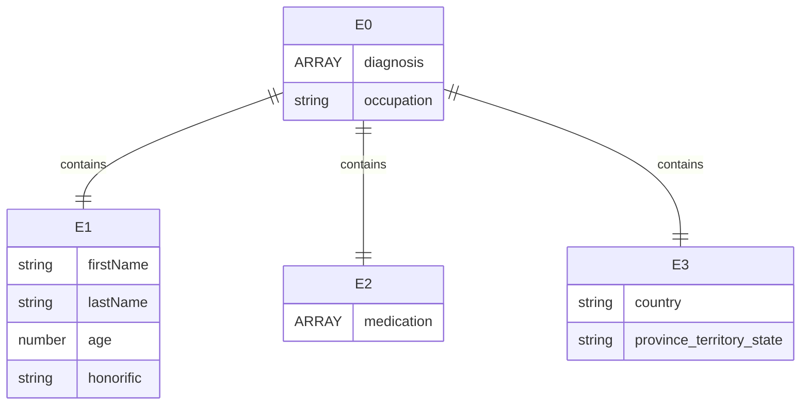

# Module 3

## Lecture


## Lab

This markdown file will serve as the central guide throughout the tutorial. Participants can follow along as the guide will provide example code, references, example files as well as explainations of each step.

The tutorial designed to instruct users of how to structure and validate data using JSON Schema. The aim is highlight the benefits of a machine readable language in harmonizing data as well as other data management practices. While the JSON context is secondary, participants will benefit from recognizing and learning to work with JSON as it has been widely adopted across industries.

The tutorial is designed to mostly work locally on your computer, but several components will need an online connection. That said a few requirements will need to be installed by the user to fully benefit from the tutorial. These are highlighted in the requirements section.

We are conscious of the varying knowledge levels of workshop participants throughout. As such, participants are encouraged to move on ahead to different sections or help out others. Please refrain from asking questions regarding upcoming content until appropriate.

All code provided assumes you're at working from a directory `RDM_workshop`
### 1. Organization

Each section will have their own folder with the following contents:
|Folder|Significance|
|--|--|
|`work`|This directory will serve as the work directory for participants to freely write their code in|
|`test`|Any prepared files will be shared here.|
|`happy_path`| When relevant, an example of the `happy_path` result will be provided to demonstrate full results of the lesson|

### 2. Requirements

- [ ] internet connection as some sections will external resources 
- [ ] A linux/bash environment
- [ ] Knowledge in basic bash scipting 
- [ ] VS code (covered in previous tutorials)
- [ ] VS code extensions
  - [ ] [Error Lens](https://marketplace.visualstudio.com/items?itemName=usernamehw.errorlens)
  - [ ] [JSON](https://marketplace.visualstudio.com/items?itemName=Meezilla.json)
  - [ ] [Markdown Preview Mermaid Support](https://marketplace.visualstudio.com/items?itemName=bierner.markdown-mermaid
  )
- [ ] Git (covered in previous tutorials)
- [ ] jq
    - `sudo apt-get install jq`
- [ ] check-jsonschema
    - `pipx install check-jsonschema`
- [ ] Python 3
    - https://www.python.org/downloads/
- [ ] `jsonschema` for python
    - `pip install jsonschema`
### 3. Introducing JSON

JSON stands for JavaScript Object Notation. It serves as a format to store and handle data.

Important to note, depending on how your choose to manage your data model and ETL (Extract, Transform, Load) pipelines will affect what you use and whether JSON will be relevant, That said, many concepts will be cross applicable. For the purposes of this tutorial we will go over JSON because we can quickly prototype data validation.

A JSON file typically has the suffix `.json` e.g. `example.json`

The contents of a JSON file were usually wrapped by curly braces `{...}`

It can be a simple as:
```
{
    "key":"value"
}
```
Or nested such as so:
```
{
    "ParentA":{
        "propertyA_1":{...}
    },
    "ParentB":[
        "childB_1":{
            "propertyB_1_1":{"..."}
        },
        "childB_2":{
            "propertyB_1_2":{"..."}
        },
    ]
}
```

We'll quickly investigate two uses of JSON. 1) For schema and 2) for a record/instance to see how similar but different they are.

#### 3.1. Basic Schema
Let's investigate what a basic schema looks like, first we open the file `3_json/3_1_basic_schema/test/schema.json`

We can see the contents as follows:
```
{
    "title": "Person",
    "type": "object",
    "properties": {
      "name": {
        "type": "string",
        "description": "The person's name."
      }
      "age": {
        "description": "Age in years which must be equal to or greater than zero.",
        "type": "integer",
        "minimum": 0
      }
    }
  }
```

##### 3.1.1 Code Breakdown

```
"title": "Person"
```

`title` field declares and name of our schema. For those familiar with entity relationships, `Person` will serve as our central node and will be where all other nodes branch out from.

An example comparison to a dataframes, the `title` would be the name of the dataframe.

```
"type":"object"
```
This piece of code is declared multiple times throughout the schema. The values as per https://www.w3schools.com/js/js_json_datatypes.asp can be the following:
```
string
number
object
array
boolean
null
```

We declare our `Person` schema as an `object` because that enables us to add other fields and properties to our schema. Said properties cannot be represented by other data types. 
Additionally because the object schema follows the notation `{'key':'value'}`, it allows us to add `properties` and give the fields and properties informative names.

```
"properties": {
    "name": {...},
    "age": {...}
    }
```

If `title` was the name of the dataframe, `properties` would be the column values of the dataframe. Within `properties` we can assign key value pairs corresponding to the data we like to collect/validate.

```
"firstName": {
        "type": "string",
        "description": "The person's first name."
      },
```
Our first example is `firstName`. We declare that the property `firstName` of a `person` must be `string`. We provide a optional and brief description to describe the field.
```
      "age": {
        "description": "Age in years which must be equal to or greater than zero.",
        "type": "integer",
        "minimum": 0
      }
```
Conversely in our second property `age` we declare it as `number` with a minimum value of `0`
#### 3.2. Basic record/instance
Let's construct a record to demonstrate the schema

Starting off with curly braces
```
{
}
```

Then we add the line "$schema" to indicate which schema we would like to validate the record against. Note typically this field is optional but for this tutorial it is required for on the fly validation.
```
{
    "$schema":"./schema.json"
}
```
Based on the schema we add the first property by declaring it `firstName` and giving it a corresponding value:
```
{
    "$schema":"./schema.json",
    "firstName" : "JoeExample"
}
```
Followed by our second property `age`

```
{
    "$schema":"./schema.json",
    "firstName" : "JoeExample",
    "age": 1
}
```
Let's demonstrate how the schema works by flipping the values:
```
{
    "$schema":"./schema.json",
    "firstName" : 1,
    "age" "JoeExample"
}
```
We can see the following errors by the interpretter
```
{
    "$schema":"./schema.json",
    "firstName" : 1, Incorrect type. Expected "string"
    "age" "JoeExample" Incorrect type. Expected "integer"
}
```
As expected, when we flip the values the schema catches the values are mismatched. What about an undeclared variable
```
{
    "$schema":"./schema.json",
    "firstName" : 1, Incorrect type. Expected "string"
    "age" "JoeExample" Incorrect type. Expected "integer"
    "honorific":"Mr"
}
```
The undeclared variable is not flagged because the schema lacks any rules for it. 
### 4. Validating Schemas

A core function and purpose of utilizing JSON format and JSON schema is data validation.<Br>
The JSON format provides a structured method of wrangling the data into a machine readable format.<Br>
The JSON Schema validates said data.<Br>
Both are customizable and can be authored to suit specific needs.

This function serves to aid data harmonization and ensuring it meets the requirements structurally and semantically.

Three methods will be highlighted to demonstrate how to perform validation

#### 4.1 Python
As a higher level programming language, Python is quick to mock up and useful for a variety of data parsing and data wrangling needs. 

One can easily validate their schema through a few lines of code, to do so we run the following
```
cd /4_validating_schemas/4_1_python/
python test/validate.py 
```
or paste the following code into a python instance
```
import json
from jsonschema import validate

with open('test/schema.json', 'r') as f:
    schema = json.load(f)

with open('test/bad_example.json', 'r') as f:
    instance = json.load(f)

validate(instance=instance, schema=schema)
```

##### 4.1.1 Breaking down the code
```
import json
from jsonschema import validate
```
Imports the libraries containing tools needed for python to wrangle JSON data. `Json` quickly ingests and converts our data into a dictionary and `validate` from `jsonschema` does the validation action.

```
with open('test/schema.json', 'r') as f:
    schema = json.load(f)

with open('test/bad_example.json', 'r') as f:
    instance = json.load(f)
```
Next, the instance and schema are ingested by opening the file and parsing them as JSON. This is done per schema and instance.

```
validate(instance=instance, schema=schema)
```
This performs the validation. If the instance is properly structured according to schema, it will silently pass.
##### 4.1.2 Understanding the error
Otherwise an error is reported. The following will produce this result:
```
Traceback (most recent call last):
  File "RDM_workshop/validate.py", line 11, in <module>
    validate(instance=instance, schema=schema)
  File "/opt/miniconda3/lib/python3.12/site-packages/jsonschema/validators.py", line 1332, in validate
    raise error
jsonschema.exceptions.ValidationError: 1 is not of type 'string'

Failed validating 'type' in schema['properties']['lastName']:
    {'type': 'string', 'description': "The person's last name."}

On instance['lastName']:
    1
```
Note the error produced `jsonschema.exceptions.ValidationError: 1 is not of type 'string'` indicating one of our fields does not conform to the schema. Specifically `lastName` as per line `Failed validating 'type' in schema['properties']['lastName']`

#### 4.2 Bash
Similar to python, we can perform validation in terminal through bash.

`check-jsonschema` is a powerful tool that validate serveral types of files include JSON. To validate, see below code example:

```
cd ../4_2_bash
check-jsonschema --schemafile test/schema.json test/good_example.json
```

#### 4.2.2 Code breakdown

`check-jsconschema` invokes the tool. Specifying the `--schemafile` identifies what the schema file should be.
 
The following is the happy path result :
```
ok -- validation done
```
#### 4.2.3 Understanding the error
If we validated the bad example:
```
check-jsonschema --schemafile test/schema.json test/bad_example.json
```
The following is the bad path result :
```
Schema validation errors were encountered.
  test/bad_example.json::$.lastName: 1 is not of type 'string'
```
As noted in the error message the `.lastName` field value is `1` and does not match the type `string`

#### 4.2.4 Validating multiple files
We can also utilize the command to validate multiple files:
```
check-jsonschema --schemafile test/schema.json test/good_example.json test/bad_example.json
```
and the result will indicate which of JSON files contains errors
```
test/bad_example.json::$.lastName: 1 is not of type 'string'
```

This is especially useful to parse multiple files

#### 4.3 VScode

With the VScode plug-in, when we open `4_validating_schemas/4_3_vscode/bad_example.json`, it dynamically applies the schema for us and highlights errors
```
{
  "$schema" : "./schema.json",
  "firstName": "John",
  "lastName": 1, Incorrect type. Expected "String".
  "age": 21
}
```
Removing line 2 aka the schema reference removes the flagged error:
```
{
  "firstName": "John",
  "lastName": 1,
  "age": 21
}
```
As the interpreter no longer has as the context that `lastName` must be a string.

Alternatively, we fix the error:
```
{
  "$schema" : "./schema.json",
  "firstName": "John",
  "lastName": "Smith",
  "age": 21
}
```

This method is useful for dynamic coding such as crafting example datasets to sanity check your schema.

### 5. JSON Syntax

Now that we know how to validate our JSON objects, let's explore more syntax to assist structuring our data. We examples we explored are simple constrain datatypes, where the following will allow for conditional rules and more advanced structure.

#### 5.1. Controlled List and arrays
```
cd 5_json_syntax/5_1_controlled_lists_and_arrays
```
Starting off with our previous schema:
```
{
    "$id": "https://example.com/person.schema.json",
    "$schema": "https://json-schema.org/draft/2020-12/schema",
    "title": "Person",
    "type": "object",
    "properties": {
      "firstName": {
        "type": "string",
        "description": "The person's first name."
      },
      "lastName": {
        "type": "string",
        "description": "The person's last name."
      },
      "age": {
        "description": "Age in years which must be equal to or greater than zero.",
        "type": "integer",
        "minimum": 0
      }
    }
  }
```
We can add the property :
```
"additionalProperties": false
```
to our schema such that it becomes:
```
{
    "$id": "https://example.com/person.schema.json",
    "$schema": "https://json-schema.org/draft/2020-12/schema",
    "title": "Person",
    "type": "object",
    "additionalProperties": false,
    "properties": {
      "firstName": {
        "type": "string",
        "description": "The person's first name."
      },
      "lastName": {
        "type": "string",
        "description": "The person's last name."
      },
      "age": {
        "description": "Age in years which must be equal to or greater than zero.",
        "type": "integer",
        "minimum": 0
      }
    }
  }
```
This restricts data to only have properties defined by the schema.

If we recheck our example
```
{
    "$schema":"./schema.json",
    "firstName" : 1, Incorrect type. Expected "string"
    "age": "JoeExample", Incorrect type. Expected "integer"
    "honorific":"Mr" Property honorific not allowed
}
```
But we want to add a record check for `honorific`. We add as before:
```
{
    "$id": "https://example.com/person.schema.json",
    "$schema": "https://json-schema.org/draft/2020-12/schema",
    "title": "Person",
    "type": "object",
    "additionalProperties": false,
    "properties": {
      "firstName": {
        "type": "string",
        "description": "The person's first name."
      },
      "lastName": {
        "type": "string",
        "description": "The person's last name."
      },
      "age": {
        "description": "Age in years which must be equal to or greater than zero.",
        "type": "integer",
        "minimum": 0
      },
      "honorific": {
        "type": "string",
        "description": " A title that conveys esteem, courtesy, or respect for position or rank when used in addressing or referring to a person"
      }
    }
  }
```
Let's validate our example:
```
{
    "$schema":"./schema.json",
    "firstName" : 1, Incorrect type. Expected "string"
    "age" "JoeExample" Incorrect type. Expected "integer"
    "honorific":"Lord Paramount"
}
```
While correct, `Lord Paramount` is an uncommon title. Let's add a controlled list to restrict the types of honorifics.
```
      "honorific": {
        "enum": ["Mr","Miss","Mrs","Mx"]
      }
```
We utilize the `enum` property and fill the array with properties that we want. This is useful in limiting the values we want to receive. It should be noted the contents are not limited to "string" data type and could any data type e.g. mix of strings and numbers

The result on our validated example:
```
    "honorific":"Lord Paramount" Value is not accepted. Valid values : "Mr","Miss","Mrs","Mx"
```
Validating our previous example shows `Lord Paramount` is no longer valid. We should correct to address:
```
{
    "$schema":"./schema.json",
    "firstName" : 1, Incorrect type. Expected "string"
    "age" "JoeExample" Incorrect type. Expected "integer"
    "honorific":"Mx"
}
```
What if we want to provide multiple values for a field? Typically that's done through an array. Let's add a new field to our schema.
```
      "diagnosis": {
        "type": "array",
        "description": "Identification of a disease, condition, or injury based on signs, symptoms, medical history, and physical exams",
        "items" : {"type" : "string"}
      }
```
- `"type": "array"` as other data types informs the record must provide the field as an `array`/`list`.
- `"items" : {"type" : "string"}` indicates the items we want within the array to match a specific criteria, in this case they must be a string items

Let's test on an example:
```
{
    "$schema":"./schema.json",
    "firstName" : 1, Incorrect type. Expected "string"
    "age" "JoeExample", Incorrect type. Expected "integer"
    "honorific":"Lord Paramount", Value is not accepted. Valid values : "Mr","Miss","Mrs","Mx"
    "diagnosis" : []
}
```
Our validation works but that's not informative if no diagnosis is given. Let's add a requirement at least one diagnosis be provided.
```
    "diagnosis": {
      "type": "array",
      "description": "Identification of a disease, condition, or injury based on signs, symptoms, medical history, and physical exams",
      "items" : {"type" : "string"},
      "minItems": 1
    }
```
Validating our example again now shows the following error:
```
    "diagnosis" : [] Array has too few items. Expected 1 or more
```
A fully valid example should look like:
```
{
    "$schema":"./schema.json",
    "firstName" : "Joe",
    "age": 18,
    "honorific":"Mx",
    "diagnosis" : ["cold"]
}
```
#### 5.2. Values by Pattern/Regex
```
cd 5_json_syntax/5_2_patterns_regex
```
Another useful feature is applying a regex or pattern check on values. This is particularly useful to ensure strings follow a particular pattern. For example, currently the field `lastName` in schema has the contents:
```
    "lastName": {
      "type": "string",
      "description": "The person's last name."
    }
```
This means even an example with a string using numbers works:
```
{
    "$schema":"./schema.json",
    "firstName" : "Joe",
    "lastName": "12",
    "age": 18,
    "honorific":"Mx",
    "diagnosis" : ["cold"]
}
```
To ensure a only letters are used in the `lastName`, we can amend the field
```
    "lastName": {
      "type": "string",
      "description": "The person's last name.",
      "pattern": "[A-Za-z- ]+"
    }
```
We add the field `pattern` to enforce a pattern check. `Pattern` field utilizes regex aka regular expression (for more info see https://regex101.com/).

We use the expression `[A-Za-z- ]+`, breaking down this regex:
- `[...]+` ensures any contents within the brackets can have multiple instances
- `A-Z` allows for capital letters
- `a-z` allows for lower case letters
- `-` allows for hyphens
- ` ` allows for spaces

If we recheck or last example against the schema:
```
{
    "$schema":"./schema.json",
    "firstName" : "Joe",
    "lastName": "12", String does not match pattern of "[A-Za-z- ]+"
    "age": 18,
    "honorific":"Mx",
    "diagnosis" : ["cold"]
}
```
A happy path example:
```
{
    "$schema":"./schema.json",
    "firstName" : "Joe",
    "lastName": "Foster-Smith",
    "age": 18,
    "honorific":"Mx",
    "diagnosis" : ["cold"]
}
```
#### 5.3. Required vs optional values
For the current schema, we can provide records missing fields. This is not ideal as we curate/build datasets that mandatory fields.
Our current schema view is :
```
{
  "$id": "https://example.com/person.schema.json",
  "$schema": "https://json-schema.org/draft/2020-12/schema",
  "title": "Person",
  "type": "object",
  "additionalProperties": false,
  "properties": {...} // Collapsed/Abbreviated Code
}
```
To demonstrate this flaw:
```
{
    "$schema":"./schema.json",
    "age": 18,
    "honorific":"Mx",
    "diagnosis" : ["cold"]
}
```
To ensure `firstName` and `lastName` are provided with all our persons, we add the field `required`
```
{
  "$id": "https://example.com/person.schema.json",
  "$schema": "https://json-schema.org/draft/2020-12/schema",
  "title": "Person",
  "type": "object",
  "required": ["firstName","lastName"],
  "additionalProperties": false,
  "properties": {...} // Collapsed/Abbreviated Code
}
```
Within `required` we list the fields that we want. In this case as an array.

Let's confirm with an example:
```
{
    Missing property "firstName"
    "$schema":"./schema.json",
    "age": 18,
    "honorific":"Mx",
    "diagnosis" : ["cold"]
}
```
If we add a `firstName`
```
{
    Missing property "LastName"
    "$schema":"./schema.json",
    "firstName" : "Joe",
    "age": 18,
    "honorific":"Mx",
    "diagnosis" : ["cold"]
}
```

#### 5.4. Conditional rules
What if we want one field to influence another? We can introduce conditional rules.

Let's add two new fields into our schema
```
    "country": {
      "enum": ["USA","Canada]
    },
    "province/territory/state": {
      "type": "string"
    }
```
We set `country` to be an enum list of `USA` and `Canada`. Depending on `country`, we want `province/territory/state` to be specific enum lists.

If we simplfy pass in an enum list of pronvinces and states, a mismatch can occur such as:
```
{
    Missing property "LastName"
    "$schema":"./schema.json",
    "firstName" : "Joe",
    "age": 18,
    "honorific":"Mx",
    "diagnosis" : ["cold"],
    "country" : "USA",
    "province/territory/state" : "Ontario"
}
```
We can add a layer of control via `if`,`else`,`then` as properties within the schema
```
{
  "$id": "https://example.com/person.schema.json",
  "$schema": "https://json-schema.org/draft/2020-12/schema",
  "title": "Person",
  "type": "object",
  "additionalProperties": false,
  "required": ["firstName","lastName"],
  "properties": {...}, // Collapsed/Abbreviated Code
  "if":{...},
  "then":{...},
  "else":{...}
}
```
Filling out the  details of our the `if`,`else`,and `then` :
```
{
  "$id": "https://example.com/person.schema.json",
  "$schema": "https://json-schema.org/draft/2020-12/schema",
  "title": "Person",
  "type": "object",
  "additionalProperties": false,
  "required": ["firstName","lastName"],
  "properties": {...}, // Collapsed/Abbreviated Code
  "if":{
    "properties":[
        "country":[]
    ]
  },
  "then":{...},
  "else":{...}
}
```
Let's add
```
  "if": {
    "properties": {
        "country": { 
          "enum": ["USA"] 
        }
    }
  }
```
In our `if` we specify which properties we want the conditional logic to verify, in our example `country`. As validate the `property` `country`, we can do regex/values or numbers. In our example, we want the logic to occur if `country` is `USA`

If `country` is `USA` the `then` code portion occurs
```
  "then": {
    "required": ["province/territory/state"],
    "properties": {
      "province/territory/state": {
        "enum": ["Wisconsin", "Virginia", "Dakota"]
      }
    }
  },
```
Like with `if` we specify when conditions are met which `properties` are affected by the conditional logic. In our example it would be `province/territory/state`. 

We specify that when `USA` is provided we want `province/territory/state` to be mandatory.
We overwrite the logic in previously provided for `province/territory/state`, such that when conditional logic is active, value must be from "enum" list.

Let's use a bad example to see if validation works.
```
{
    Missing property "province/territory/state"
    "$schema":"./schema.json",
    "age": 18,
    "honorific":"Mx",
    "diagnosis" : ["cold"],
    "country" : "USA"

}
```
The conditional required field works. What about the enum value?
```
{
    "$schema":"./schema.json",
    "age": 18,
    "honorific":"Mx",
    "diagnosis" : ["cold"],
    "country" : "USA",
    "province/territory/state" : "Quebec" Value is not accepted. Valid values : "Wisconsin", "Virginia", "Dakota"
}
```
What if we switch `country` from `USA` to `Canada` and `Quebec` to `Dakota`. What would be the result?
```
{
    "$schema":"./schema.json",
    "age": 18,
    "honorific":"Mx",
    "diagnosis" : ["cold"],
    "country" : "Canada",
    "province/territory/state" : "Dakota"
}
```
Clearly the wrong pairing but schema is not flagging it so let's fix that.

Our condition logic operates on the `if` and `then`. Now we need to do an `else`

Like with the `then` we can format `else` similarly but swap out the values:
```
  "if": {
    "properties": {
        "country": { 
          "enum": ["USA"] 
        }
    }
  },
  "then": {
    "required": ["province/territory/state"],
    "properties": {
      "province/territory/state": {
        "enum": ["Wisconsin", "Virginia", "Dakota"]
      }
    }
  },
  "else": {
    "required": ["province/territory/state"],
    "properties": {
      "province/territory/state": {
        "enum": ["Quebec","Ontario","British Columbia"]
      }
    }
  }
```
Let's revalidate our previous example:
```
{
    "$schema":"./schema.json",
    "age": 18,
    "honorific":"Mx",
    "diagnosis" : ["cold"],
    "country" : "Canada",
    "province/territory/state" : "Dakota" Value is not accepted. Valid values : "Quebec","Ontario","British Columbia"
}
```
### 6. Mermaid

Data models can become complex and when written in code is hard to navigate. One way around that is via diagrams that visualize the relationships of our data model.

There are variety of ways to do so, the following is one suggestion.

Given our JSON
```
{
    "$schema":"./schema.json",
    "firstName" : "Joe",
    "lastName": "Foster-Smith",
    "age": 18,
    "honorific":"Mx",
    "diagnosis" : ["cold"],
    "country" : "Canada",
    "province/territory/state" : "Quebec"
}
```

We can pass that into the following online converter. As mentioned there is multiple ways of doing the conversion. This is a quick and fast method.

We utilize mermaid, a java-script based language to charts and diagraming.

We navigate to the site:
https://toolshref.com/json-to-mermaid-generator/

Paste our JSON, set to ER diagram and receive the following output.



We can see our instance has the following attributes.

What if we tried a more complicated example?:
```
{
        "person_identification":{
            "firstName" : "Joe",
            "lastName": "Foster-Smith",
            "age": 18,
            "honorific":"Mx"
        },
        "treatment":{
            "medication":[
                {
                    "medication_name":"acetonminophen",
                    "dose":"5mg"
                },
                {
                    "medication_name":"dextromethorphan",
                    "dose":"5mg"
                },
                {
                    "medication_name":"phenylephrine",
                    "dose":"5mg"
                }
            ]

        },
        "residence":{
        "country" : "Canada",
        "province/territory/state" : "Quebec"
        },
        "diagnosis" : ["cold","dizziness"],
        "occupation" : "hooligan"
}
```
Copying the above yields the following:

- `E0` represents our person who has the properties `diagnosis` and `occupation`
- additionally our person has the properties: `person_identification`,`treatment` and `residence` as `E1`,`E2`, and `E3` respectively.

### 7. External Ontology validation

#### 7.1 Exploration

Ontologies briefly explored with several examples examined for utility and purpose. Utilizing them can often be tricky as ontologies can be implemented differently.

As such depending on said resource, it can be difficult to incorporate ontology validation in our working example of JSON schemas.

While we enforce patterns, we cannot verify the existance of content. We will further explore how to implement custom code to do so. Note this will differ according to circumstance. 

For the tutorial we're be exploring ICD10 and some resources affiliated with the project.

ICD10 stands for International Statistical Classification of Diseases and Related Health Problems 10th Revision and codes medical diagnoses, symptoms, and external causes of injury.
- can be explored in https://icd.who.int/browse10/2019/en e.g. https://icd.who.int/browse10/2019/en#/C34 and https://icd.who.int/browse10/2019/en#/U10.9 
- follow a pattern structure of `^[A-Z][0-9][A-Z0-9](\.[A-Z0-9]{1,4})?$` e.g. `C34` and `U10.9`

We can verify codes utilizing the resource : [icd10api.com](https://icd10api.com/)
- It provides an useful interface for searching up codes
- The backend is powered by an API (applicaiton programming interface) that allows us to the before a search function to verify ICD10.
- Note APIs often have rate limits (queries allowed), so strategize and plan accordingly when utilizing public resources

Let's explore how to utilize the API.

Going to https://icd10api.com/#:~:text=JSONP%20callback%20name.-,Examples,-Code%20Lookup we can perform a code look by.

If we provide `C34` we get the following response:
```
Request:
http://icd10api.com/?code=C34&desc=short&r=json
```
```
Response:
{
    "Name": "C34",
    "Description": "Malignant neoplasm of bronchus and lung",
    "Valid": "0",
    "Inclusions": [],
    "ExcludesOne": [
        "Kaposi's sarcoma of lung (C46.5-)",
        "malignant carcinoid tumor of the bronchus and lung (C7A.090)"
    ],
    "ExcludesTwo": [],
    "Type": "ICD-10-CM",
    "Response": "True"
}
```
The API generates a URL and response. The Request will be useful later as we automate the check. For now lets explore the response.


The response is provided in JSON format and include multiples.

We can get a breakdown of the contents : https://icd10api.com/#:~:text=RESET-,Fields,-When%20validating%20codes
- `name` returns the queried code
- `description` describes diagnosis and grounds it's classified
- `Response` a binary status indicating if our code is in the database

Let's explore an example of querying a nonexistant code - Paste the following into your browser:
```
https://icd10api.com/?code=A0001&desc=short&r=json
```
We get the follow response:
```
{"Response":"False","Error":"Incorrect ICD Code"}
```

Now that we have an understand of how to validate ICD10 codes, let's incorporate it into our validation flow.

#### 7.2 Incorporating external ontology validation

In this section we'll explore how to perform both schema and external ontology validation a set of files programmatically.

Note the following section is not the only method for validating your data in bulk. It is conceptual combining multiple validation to demonstrate a flow.

Navigating to

Navigating to `/4_external_ontology_validation/examples`, we can view contents by performing:
```
ls
```
We'll see we have three examples of objects/records to be validated 
```
A.json
B.json
C.json
```
We also have the `schema.json`. If we've following the tutorial, the contents are recognizable aside from the addition
```
    "icd10": {
    "description": "Identification of a disease, condition, or injury based on signs, symptoms, medical history, and physical exams. Using ICD10 codes",
    "type": "string"
    }
```

Let's create a few folders to track our results
```
mkdir schema_validation
mkdir icd10_validation
mkdir validation_results
```
Check all folders are empty:
```
ls schema_validation
ls icd10_validation
ls validation_results
```
We know we can validate our schema, for example using:
```
check-
jsonschema --schemafile schema.json A.json
```
But let's capture the result
```
check-jsonschema --schemafile schema.json A.json && touch schema_validation/A.SUCCESS || touch schema_validation/A.FAILURE 
```
- `check-jsonschema --schemafile schema.json A.json` run our command as previous.
- ` && touch schema_validation/A.SUCCESS` AND if successul we generate a `schema_validation/A.SUCCESS` file
- `|| touch schema_validation/A.FAILURE` OR if not successful generate a `schema_validation/A.FAILURE` file

Doing this for all three
```
check-jsonschema --schemafile schema.json A.json && touch schema_validation/A.SUCCESS || touch schema_validation/A.FAILURE 
check-jsonschema --schemafile schema.json B.json && touch schema_validation/B.SUCCESS || touch schema_validation/B.FAILURE 
check-jsonschema --schemafile schema.json C.json && touch schema_validation/C.SUCCESS || touch schema_validation/C.FAILURE 
```
Inspecting our results:
```
ls schema_validation
```
shows:
```
A.SUCCESS  B.FAILURE  C.SUCCESS
```
Success for `A` and `C` but schema validation failure on `B`

Let's continue with external ontology validation:
```
jq -r '.icd10' A.json \
  | xargs -I{} curl -s "https://icd10api.com/?code={}&desc=short&r=json" \
  | jq -e '.Response == "True"' \
  && touch icd10_validation/A.SUCCESS || touch icd10_validation/A.FAILURE
```
- `jq` is a useful unix too for parsing JSONs
- `jq -r '.icd10' A.json` reads `A.json` and returns the `icd10` field.
- `xargs -I{}` our returned response is iterated over like a forloop
- `curl -s "https://icd10api.com/?code={}&desc=short&r=json` where each value of `icd10` in our `A.json` is substituted into the query in the section defined by `{}`.
- curl is useful tool to retrieve and return data
- our result from retrieving data from the icd10api is then passed into another `jq` interpretation
- `jq -e '.Response == "True"'`, the returned JSON is evaulated for the `Response` field is true or not.
-  `&& touch icd10_validation/A.SUCCESS` if true generate `.SUCCESS` file
- `touch icd10_validation/A.FAILURE` otherwise `.FAILURE`

If we perform this for all our example:
```
jq -r '.icd10' A.json \
  | xargs -I{} curl -s "https://icd10api.com/?code={}&desc=short&r=json" \
  | jq -e '.Response == "True"' \
  && touch icd10_validation/A.SUCCESS || touch icd10_validation/A.FAILURE

jq -r '.icd10' B.json \
  | xargs -I{} curl -s "https://icd10api.com/?code={}&desc=short&r=json" \
  | jq -e '.Response == "True"' \
  && touch icd10_validation/B.SUCCESS || touch icd10_validation/B.FAILURE

jq -r '.icd10' C.json \
  | xargs -I{} curl -s "https://icd10api.com/?code={}&desc=short&r=json" \
  | jq -e '.Response == "True"' \
  && touch icd10_validation/C.SUCCESS || touch icd10_validation/C.FAILURE
```
Now let's combine our results:

```
[ -f schema_validation/A.SUCCESS ] && [ -f icd10_validation/A.SUCCESS ] && touch validation_result/A.SUCCESS || touch validation_result/A.FAILURE
```
- ` -f schema_validation/A.SUCCESS` checks for the existence of the file `schema_validation/A.SUCCESS`
- `[ -f schema_validation/A.SUCCESS ] && [ -f icd10_validation/A.SUCCESS ]` combine the two means both `SUCCESS` files must exist
- `&& touch validation_result/A.SUCCESS` if they do summarize into `validation_result/A.SUCCESS`
- `|| touch validation_result/A.FAILURE` otherwise report as a failure

Performing this action for all our objects
```
[ -f schema_validation/A.SUCCESS ] && [ -f icd10_validation/A.SUCCESS ] && touch validation_result/A.SUCCESS || touch validation_result/A.FAILURE
[ -f schema_validation/B.SUCCESS ] && [ -f icd10_validation/B.SUCCESS ] && touch validation_result/B.SUCCESS || touch validation_result/B.FAILURE
[ -f schema_validation/C.SUCCESS ] && [ -f icd10_validation/C.SUCCESS ] && touch validation_result/C.SUCCESS || touch validation_result/C.FAILURE
```
Let's review our progress:
```
ls *
```
We can see the following:
```
icd10_validation:
A.SUCCESS  B.SUCCESS  C.FAILURE

schema_validation:
A.SUCCESS  B.FAILURE  C.SUCCESS

validation_result:
A.SUCCESS  B.FAILURE  C.FAILURE
```
- `A` was the only record that passed both schema and external ICD10 check
- `B` had a valid ICD10 code but failed the schema
- `C` passed the schema check but failed the ICD10 validation.


### 8 Additional challenges

The following are additional scenarios for participants to tests. While these are not covered in the tutorial, participants are encouraged to test what they've learnt by attempting the challenges.

#### 8.1 Required object

We've explored how to enforce required properties, what if those fields were not `numbers` or `strings` but rather an `object`. Would that affect how we handled required properties?

In `8_additional_challenges/8_1_required_object/work` you'll find an example `schema.json` missing the object `occupation`. Fill that in based on the example `example.json`. Make all fields required. 

#### 8.2 Nested IF ELSE

Given our schema contains `if` `else` to catch two scenarios, what if we added a third? How would we account for that? This can be done by nesting another `If` `else` under the `else` of the original. How would that look like? The following are a few test cases and a starting place for the schema.

Your goal is produced a nested `if else` where the following occurs:
- if `country` is `USA` then the states are `Wisconsin`,`Virginia`,`Dakota`
- if `country` is `Canada` then the states are `Sonora`,`Puebla`,`Yucatán`
- if `country` is `Mexico` then the states are  `Quebec`,`Ontario`,`Vancouver`

in `8_additional_challenges/8_2_nested_if_else/work` you'll find a starting `schema.json` and the example files `A.json`,`B.json` and `C.json` to  